# Krista WhatsApp Extension — Complete Interview Preparation Guide

> A beginner-to-expert walkthrough of the Krista WhatsApp Business chatbot.
> Use this guide to internalize architecture, design choices, AI integration, and answer interview questions confidently.

---

## Table of Contents

1. [Phase 1 — Executive Summary](#phase-1--executive-summary)
2. [Phase 2 — High-Level Architecture](#phase-2--high-level-architecture)
3. [Phase 3 — End-to-End Request Flow](#phase-3--end-to-end-request-flow)
4. [Phase 4 — Deep Dive into Every Component](#phase-4--deep-dive-into-every-component)
5. [Phase 5 — Technology Stack Analysis](#phase-5--technology-stack-analysis)
6. [Phase 6 — AI/LLM Deep Dive](#phase-6--ailllm-deep-dive)
7. [Phase 7 — Database (Infinispan) Deep Dive](#phase-7--database-infinispan-deep-dive)
8. [Phase 8 — API Deep Dive](#phase-8--api-deep-dive)
9. [Phase 9 — Performance and Scalability](#phase-9--performance-and-scalability)
10. [Phase 10 — Monitoring and Production Operations](#phase-10--monitoring-and-production-operations)
11. [Phase 11 — Security Analysis](#phase-11--security-analysis)
12. [Phase 12 — Interview Preparation Q&A](#phase-12--interview-preparation-qa)
13. [Phase 13 — Project Story for Interviews](#phase-13--project-story-for-interviews)
14. [Phase 14 — Resume Alignment](#phase-14--resume-alignment)
15. [Phase 15 — Cheat Sheet, Self-Test, Confidence Checklist](#phase-15--cheat-sheet-self-test-confidence-checklist)

---

# Phase 1 — Executive Summary

## 1.1 What problem does this project solve?

The **Krista WhatsApp Extension** (`krista-whatsapp`) is an enterprise-grade **conversational AI assistant** that runs over **WhatsApp Business** and lets end-users interact with a company's business systems (e.g., **Adani Electricity**) using natural language in their preferred language (English, Hindi, Marathi).

Where a traditional customer-service portal forces the user to:

- Navigate a website / app
- Find the right form
- Fill all fields manually
- Submit, then hope to track status

…this extension lets them **just chat on WhatsApp**: *"Pay my bill"*, *"मेरा बिल भरना है"*, *"नवीन तक्रार नोंदवायची आहे"* — and the AI bot figures out:

1. **Which workflow** the user wants (intent detection)
2. **What fields** that workflow needs (e.g., consumer number, complaint type)
3. **How to collect them** one by one in natural language
4. **How to call the back-end Krista platform** to actually execute the workflow
5. **How to deliver the final answer/result** back to the user on WhatsApp

## 1.2 Who are the users?

- **End consumers** of an enterprise — primary users — who want self-service over WhatsApp (e.g., Adani Electricity customers).
- **Enterprise IT / business analysts** — who design "catalog requests" (conversations) in the Krista platform and don't need to write any UI code for WhatsApp because this extension auto-bridges them.
- **Internal operators** — who monitor live conversations, review transcripts, and tune intent descriptions.

## 1.3 Business value

- **Reduced call-center load** — every conversation handled by the bot is a call/ticket the human team didn't have to handle.
- **24×7 availability** — WhatsApp is always up; the bot never sleeps.
- **Multi-lingual reach** — English / Hindi / Marathi (and easy to extend) without rebuilding flows.
- **Zero-UI** — Business teams add new workflows in Krista Studio; the bot picks them up automatically via `ConversationToolRegistry.syncConversations()`.
- **Audit trail** — Full conversation transcripts are captured and delivered to the catalog for compliance, training, and analytics.

## 1.4 End-to-end workflow (one paragraph)

A user sends *"HI"* on WhatsApp → HeloAI's WABA gateway POSTs a webhook into our `WhatsAppResource` → the message lands in `SessionOrchestrator` → a virtual thread picks up a per-phone `ReentrantLock` → the session loads from Infinispan → the orchestrator's **state machine** decides which state we're in (Init / Idle / Collecting / Exit) → the LLM (`gpt-4o-mini` via LangChain4J) is invoked with a carefully-built system prompt and a list of **tool specifications** (one per available business workflow) → the LLM returns either a text reply or a **tool call** like `Pay_Bill` → the **`ToolExecutor` loop** dispatches the tool, which calls the Krista platform's `ConversationExecution` → if more fields are needed the state transitions to `CollectingFieldState` and the bot asks the user the next question → when all fields are collected the LLM calls `submit_answer`, the back-end conversation completes, **ActiveMQ** publishes a completion event → `ConversationCompletionListener` fires → the result is sent back to the user. Throughout, every message is persisted to Infinispan, scheduled cleanup tasks expire idle sessions (5 min) and old transcripts (20 days), and the access token is refreshed every 4 hours.

## 1.5 Why was the project built?

This is the **rewrite** of an older module (`heloai-waba-extension` + `heloai-waba-persistence`) that used the **OpenAI Realtime API** (audio-style streaming with hidden state).

Problems with the old approach:

- Realtime API is expensive, opaque, hard to debug, and was overkill for text-only chat.
- State was implicit inside OpenAI → hard to inspect, no audit trail, no replay.
- Difficult to add new business workflows dynamically.

The rewrite uses the **OpenAI Completions API** (via LangChain4J's `OpenAiChatModel`), an **explicit state machine** in our own code, and **tool-calling** to drive business workflows. Result: cheaper, fully inspectable, debuggable, and trivially extensible.

## 1.6 Key features

- 4-state explicit conversation state machine (Init / Idle / Collecting / Exit)
- LLM-driven intent detection + tool-calling (LangChain4J 1.9.1)
- Dynamic registration of business workflows as LLM tools (`ConversationToolRegistry`)
- Multi-language (en/hi/mr) with auto-detection on first message
- Interactive WhatsApp messages (buttons, lists, pagination 9-per-page with "View More")
- Full conversation persistence on Infinispan (distributed in-memory data grid)
- Per-phone fair `ReentrantLock` for serialised message processing
- Java 21 virtual threads everywhere + JFR pinning monitor
- Auto-refreshing WhatsApp access token
- Scheduled cleanup: 5-min idle session timeout, 20-day transcript retention
- Event-driven session-end transcript capture (KE-3068)

---

# Phase 2 — High-Level Architecture

## 2.1 Module landscape (the whole monorepo)


<details><summary>Mermaid source</summary>

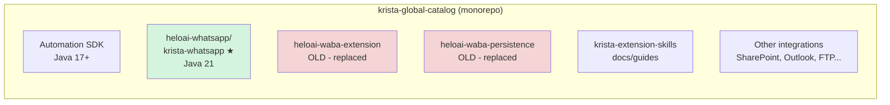

</details>

`krista-whatsapp` is the module we focus on; it replaces the legacy `heloai-waba-*` modules.

## 2.2 Component diagram (inside `krista-whatsapp`)


<details><summary>Mermaid source</summary>

```mermaid
flowchart TB
    subgraph API["api/  (JAX-RS layer)"]
        WAR[WhatsAppResource<br/>POST /incoming/messages<br/>POST /dlr/messages]
        CR[ConversationResource]
        FR[FormApiResource]
        WSR[WorkspaceResource]
        HR[HealthResource]
    end

    subgraph ORCH["orchestrator/  (brain)"]
        SO[SessionOrchestrator]
        SC[SessionContext]
        SF[SessionFactory]
        FC[FieldCollector]
        TE[ToolExecutor]
        MF[MessageFormatter]
        IMP[InformMessageProcessor]
        DIM[DefaultInboxMessageListener]
        STATE[state/<br/>Init / Idle / Collecting / Exit]
        TOOLS[tools/<br/>SubmitAnswer / PickOneField / ExitSession / ConversationRemoteTool]
    end

    subgraph CHAT["chat/ + util/  (LLM)"]
        CLMP[ChatLanguageModelProvider]
        CSV[ChatService]
        IB[InstructionBuilder]
        INS[Instructions]
        LLM[LlmService]
    end

    subgraph SVC["service/  (integrations)"]
        ATH[AccessTokenHolder]
        HAC[HeloAIWabaClient<br/>MessageSender]
        SCS[SessionCleanupService]
        TCS[TranscriptCleanupService]
        SLM[SessionLockManager]
        SMF[SessionMessageFactory]
        CCL[ConversationCompletionListener<br/>ActiveMQ]
        PSV[PlatformService]
    end

    subgraph PERS["persistence/  (Infinispan)"]
        SR[SessionRepository]
        SMR[SessionMessageRepository]
        WS[WabaSession BO]
        SM[SessionMessage BO]
        II[InfinispanInitializer]
    end

    subgraph CAT["catalog/  (Krista catalog)"]
        CA[ConversationArea<br/>Get Transcript]
        MA[MediumArea<br/>Session / Phone / Verify APIs]
    end

    subgraph MON["monitoring/"]
        VTM[VirtualThreadPinningMonitor]
    end

    WAR --> SO
    DIM --> SO
    SO --> SC
    SO --> SF
    SO --> TE
    SO --> FC
    SO --> MF
    SO --> IMP
    SO --> STATE
    SO --> TOOLS
    SO --> SLM

    TE --> CLMP
    LLM --> CLMP
    TOOLS --> CLMP
    IB --> INS

    SF --> PSV
    TOOLS --> PSV
    SO --> PSV
    SO --> HAC
    HAC --> ATH
    SCS --> SR
    TCS --> SMR
    CCL --> SO

    SR --> WS
    SMR --> SM
    SR --> II
    SMR --> II

    CA --> SMR
    MA --> SR

    KristaWhatsAppExtension --> ALL[everything]
    style ORCH fill:#fff3cd
    style CHAT fill:#cfe2ff
    style PERS fill:#d4f4dd
    style SVC fill:#f8d7da
```

</details>

## 2.3 System architecture (deployed view)


<details><summary>Mermaid source</summary>

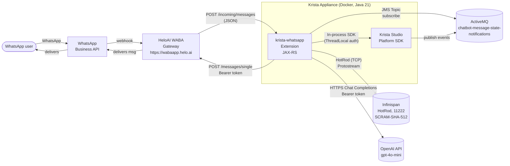

</details>

## 2.4 Request flow (very high-level)


<details><summary>Mermaid source</summary>

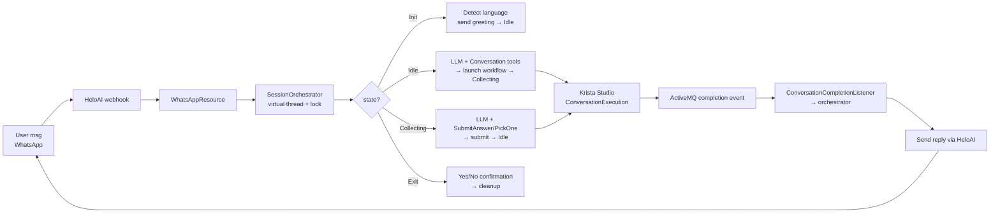

</details>

## 2.5 Deployment diagram


<details><summary>Mermaid source</summary>

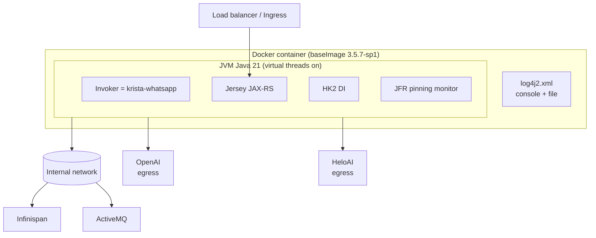

</details>

Single container; multiple replicas can run because Infinispan + ActiveMQ are shared state.

---

# Phase 3 — End-to-End Request Flow

Let's trace a single concrete journey: **a new user types "HI" on WhatsApp and goes through "Pay Bill"**.

## 3.1 Sequence diagram (full happy path)


<details><summary>Mermaid source</summary>

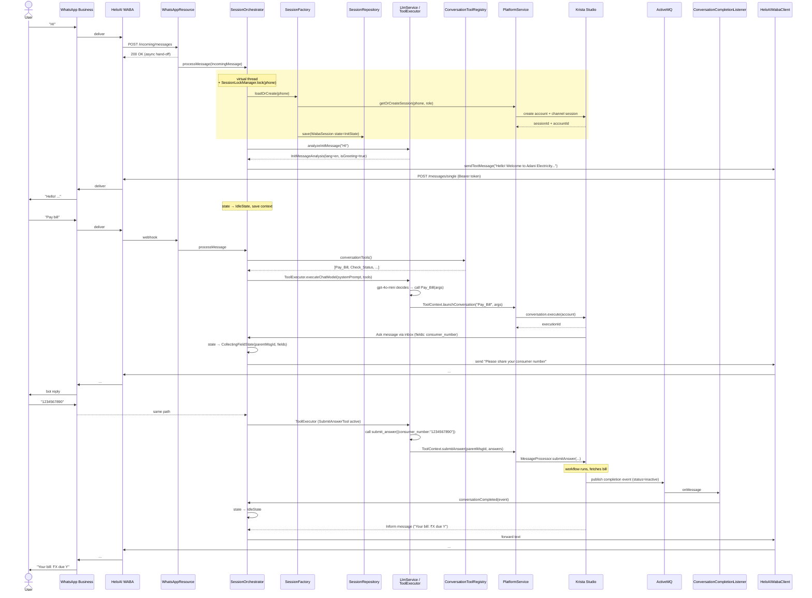

</details>

## 3.2 Step-by-step walkthrough with file references

| # | Step | File / Class | Key methods |
|---|---|---|---|
| 1 | User sends "HI" on WhatsApp | external | — |
| 2 | WhatsApp delivers to HeloAI which POSTs our webhook | external | — |
| 3 | Webhook entry, validates the `to` field equals our configured phone | `api/WhatsAppResource.java` | `receiveIncomingMessage()` lines ~42-76 |
| 4 | Deserialise to `IncomingMessage` POJO using `GSON_JSON_MAPPER` | `api/message/IncomingMessage.java` | — |
| 5 | Returns HTTP 200 to HeloAI **immediately**, then processes asynchronously | `WhatsAppResource` | — |
| 6 | Routed to orchestrator | `orchestrator/SessionOrchestrator.java` | `processMessage(IncomingMessage)` lines 402-460 |
| 7 | Virtual thread spun; per-phone `ReentrantLock(fair=true)` acquired | `service/SessionLockManager.java` | `getLock(phone)` |
| 8 | Session loaded or created | `orchestrator/SessionFactory.java` | `loadOrCreate(phone, msg)` lines 34-49 |
| 9 | If new: platform creates session/account; `OrchestrationState=InitState` saved | `service/platform/PlatformServiceImpl.java` | `getOrCreateSession(...)` lines 663-692 |
| 10 | State router decides | `SessionOrchestrator` | `processMessage(context, msg)` lines 576-609 |
| 11 | **InitState** → LLM detects language/intent | `orchestrator/LlmService.java` | `analyzeInitMessage()` lines 46-118 |
| 12 | Bot sends greeting in detected language | `service/HeloAIWabaClient.java` | `sendMessage()` lines 60-150 |
| 13 | State → `IdleState`, session flushed to Infinispan | `SessionContext.java` | `flushContext()` lines 462-471 |
| 14 | Next user msg ("Pay bill") same path until `handleIdle()` | `SessionOrchestrator` | `handleIdle()` lines 725-765 |
| 15 | Tool registry assembled (sync'd from backend on load) | `orchestrator/tools/ConversationToolRegistry.java` | `conversationTools()` lines 61-63 |
| 16 | LLM + tool loop runs | `orchestrator/ToolExecutor.java` | `executeChatModel()` lines 62-143 |
| 17 | LLM picks a `ConversationRemoteTool` to call | `tools/ConversationRemoteTool.java` | `execute()` lines 35-47 |
| 18 | Conversation launched on Krista platform; `executionId` saved | `PlatformServiceImpl` | `launchConversation()` lines 113-192 |
| 19 | Studio comes back with an `Ask` message containing required fields | `DefaultInboxMessageListener.java` | `messageReceived()` lines 26-40 |
| 20 | State → `CollectingFieldState`, system message built from field schema | `SessionOrchestrator` | `processAskMessage()` lines 224-285 |
| 21 | Bot asks "Please share your consumer number" | `MessageFormatter.java` | `buildFieldCollectionSystemMessage()` lines 55-138 |
| 22 | User answers; `SubmitAnswerTool` invoked | `tools/SubmitAnswerTool.java` | `execute()` lines 65-99 |
| 23 | Fields validated and submitted via `submitAnswer` | `PlatformServiceImpl` | `submitAnswer()` lines 750-794 |
| 24 | Conversation completes inside Studio | external | — |
| 25 | Studio publishes a completion event to ActiveMQ | external | topic `chatbot-message-state-notifications` |
| 26 | Listener consumes, dispatches to orchestrator | `service/messaging/ConversationCompletionListener.java` | `onMessage()` lines ~60-120 |
| 27 | Final reply sent over WhatsApp | `HeloAIWabaClient` | — |
| 28 | Every assistant/user/tool message persisted to Infinispan | `persistence/repository/impl/SessionMessageRepositoryImpl.java` | `save()` / `addMessages()` |

## 3.3 Side-channel flows


<details><summary>Mermaid source</summary>

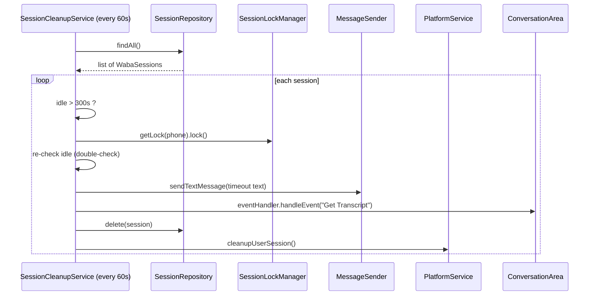

</details>

Equivalent for `TranscriptCleanupService` (every 24h, deletes messages older than 20 days).

---

# Phase 4 — Deep Dive into Every Component

## 4.1 `KristaWhatsAppExtension` — the entry point

**File:** `app/krista/whatsapp/KristaWhatsAppExtension.java`

Annotated as `@Extension`, `@Domain`, `@Java(JAVA_21)`, `@Containerize`. This is how a Krista platform appliance discovers and loads the bot.

**Lifecycle hooks**:

| Hook | What it does |
|---|---|
| `onInvokerLoad()` | Inits inbox listener, access-token holder, conversation tool registry, session/transcript cleanup, JFR monitor |
| `onInvokerUpdate()` | Validates config changes, updates `ChatLanguageModelProvider` with new API key/model, re-syncs conversations |
| `onInvokerUnload()` | Graceful shutdown of all services |
| `validateAttributes()` | Validates phone number = 12 digits |

**Configured fields** the operator sets in Krista Studio:

```
User Role, Agent Role, User Id, API Key (secured),
Phone number, OpenAI Model, OpenAI secret key (secured),
Secure Dev Token
```

### Design decision: HK2 DI

The whole extension uses **HK2** (Glassfish DI) for wiring. Each `@Service` is a singleton resolved at startup. `KristaWhatsAppExtension` is wired with everything it needs and only orchestrates lifecycle.

---

## 4.2 The orchestrator — the brain of the bot

### 4.2.1 `SessionOrchestrator`

**File:** `orchestrator/SessionOrchestrator.java` (lines 61-905) — the largest class.


<details><summary>Mermaid source</summary>

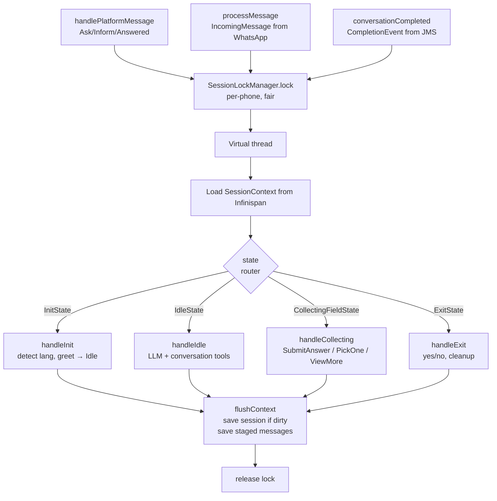

</details>

**Important methods & lines**:

| Method | Lines | Purpose |
|---|---|---|
| `handlePlatformMessage(Message)` | 137-202 | Receives Ask/Inform/Answered from Krista SDK |
| `processMessage(IncomingMessage)` | 402-460 | Receives user WhatsApp messages from inbox |
| `processMessage(context, msg)` | 576-609 | Core state-routing `switch` |
| `handleInit` | 692-717 | Language + greeting via `LlmService.analyzeInitMessage()` |
| `handleIdle` | 725-765 | LLM with conversation tools, may launch workflow |
| `handleCollecting` | 770-822 | Field collection; supports "View More" pagination |
| `handleExitTrigger` / `handleExit` | 611-667 | Yes/No exit confirmation flow |
| `conversationCompleted` | (callback) | Fires when ActiveMQ event arrives |
| `flushContext` | 462-471 | Persist dirty state + staged messages |
| `formatMessagesForDebug` | 512-531 | Debug-log message history on error |

### 4.2.2 `SessionContext` — per-request state holder

**File:** `orchestrator/SessionContext.java`

Holds **transient** state during a single request:

```java
private final WabaSession session;                   // loaded from cache
private final List<SessionMessage> stagedMessages;   // accumulated during this turn
private OrchestrationState orchestrationState;       // current state object
private boolean isSessionDirty;                      // mark for flush
private Map<String, String> updatedSessionData;      // data delta
```

**Key trick — Dangling Tool Response Filtering (lines 136-169)**:

When loading the last 20 messages for the LLM, if the message window cuts off an *assistant's tool-call request* but keeps the *tool result*, the LLM API will error out (orphan response). The code filters tool results whose call-id is not present in the loaded assistant messages.

### 4.2.3 The state machine

**Sealed interface `OrchestrationState` permits four states.** Jackson polymorphic JSON serialization (`@type` discriminator) is used to persist state.


<details><summary>Mermaid source</summary>

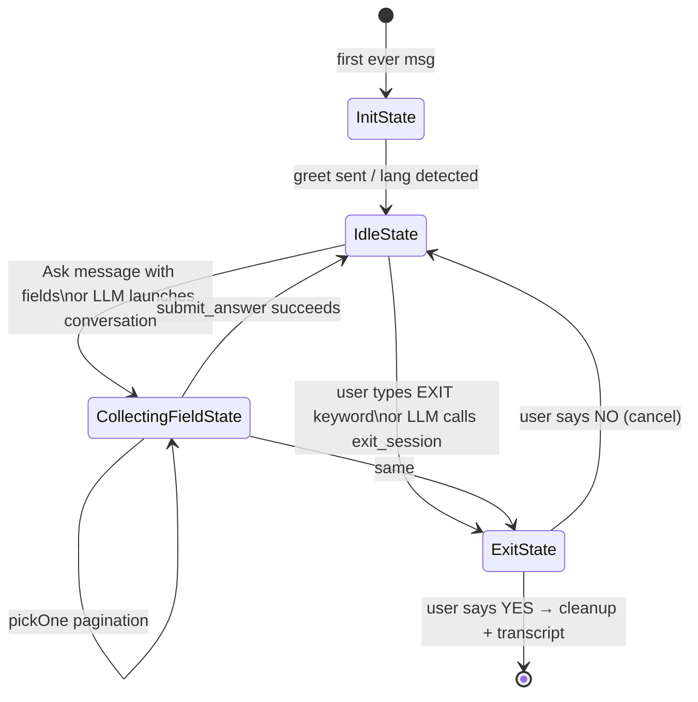

</details>

**State files** (all in `orchestrator/state/`):

- `InitState.java` — empty marker record
- `IdleState.java` — empty marker record  
- `CollectingFieldState.java` — holds `parentMessageId`, `List<ConversationField>`, `collectedFieldValues`, pagination (`pickOneOptions`, `pickOnePage`)
- `ExitState.java` — wraps `previousState` so it can be restored on cancel
- `OrchestrationStateSerializer.java` — JSON ser/deser with fallback to `IdleState`

### 4.2.4 `ToolExecutor` — the LLM-tools loop

**File:** `orchestrator/ToolExecutor.java`

This is the heart of LLM integration. Pseudocode of `executeChatModel`:

```text
messages = [SystemMessage] + lastN session messages
iter = 0
loop:
  iter++
  if iter > MAX_ITERATIONS (10): throw
  response = chatModel.chat( ChatRequest(messages, toolSpecs) )
  messages.add(response.aiMessage)
  if response has tool calls:
    if multiple submit_answer: merge args
    for each tool req:
      tool = remoteToolMap.get(name)
      result = tool.execute(toolContext, args)
      messages.add(ToolExecutionResultMessage(...))
      if result == StopLoop or TriggerExitFlow: break loop
  else:
    finalResponse = response.aiMessage.text()
    break
stage new messages in context
return (finalResponse, exitFlowTriggered)
```

`ToolResult` is a **sealed interface** with `Continue`, `StopLoop`, `TriggerExitFlow` — type-safe signalling.

### 4.2.5 Tools

| Tool | Spec name | Purpose |
|---|---|---|
| `ConversationRemoteTool` | dynamic (`Pay_Bill`, etc.) | Launch a Krista conversation/workflow |
| `SubmitAnswerTool` | `submit_answer` | Validate + submit collected fields to Studio |
| `PickOneFieldTool` | `show_options` | Display interactive list message (9 per page + View More) |
| `ExitSessionTool` | `exit_session` | Trigger exit confirmation |
| `SwitchLanguageTool` | `switch_language` | Switch session language mid-flow |

`ConversationToolRegistry` keeps a `ConcurrentHashMap<ToolSpecification, RemoteTool>` and a `CopyOnWriteArrayList<ConversationInfo>` synced from the backend.

### 4.2.6 Field collection

`FieldCollector` extracts field values from user messages, supporting:

- **text** → via LLM
- **number** → regex + min/max validation
- **bool** → checks button reply first, else LLM yes/no classify
- **pickOne / pickList** → button/list reply, else LLM matching
- **date / time / datetime** → format validation
- **location** → from WhatsApp location message (`lat;lng;name;address`)

### 4.2.7 Design decisions & alternatives

| Decision | Rationale | Alternative | Pros / Cons |
|---|---|---|---|
| Explicit state machine (sealed types) | Type-safe; LLM can't lie about state | Pure LLM driven | LLM-only is cheaper but unreliable |
| LangChain4J + Completions, not Realtime | Cheaper, debuggable | OpenAI Realtime API | Realtime opaque + costly |
| Per-phone ReentrantLock | Serialise multi-msg burst | Distributed lock (Redis) | Single-node only but the appliance is sticky-routed |
| Virtual threads | Cheap blocking I/O | Reactive streams | Virtual threads = simpler code |
| 20-message window | Token cost vs context | Full history | Trade-off |
| Tools as registry, dynamic | Add workflow without code change | Static enum | Registry wins for extensibility |

---

## 4.3 Chat / LLM layer

**Files:** `chat/ChatLanguageModelProvider.java`, `chat/ChatService.java`, `util/InstructionBuilder.java`, `util/Instructions.java`, `orchestrator/LlmService.java`

### 4.3.1 `ChatLanguageModelProvider`

- Builds a `dev.langchain4j.model.openai.OpenAiChatModel` instance.
- Default model: `gpt-4o-mini`. Temperature: `0.7`. Timeout: `60s`. MaxRetries: `2`.
- Uses a `ReentrantReadWriteLock` for **runtime re-configuration** (when the operator updates the OpenAI API key in Studio, `updateConfiguration()` swaps the singleton model under a write lock).

### 4.3.2 `InstructionBuilder` + `Instructions`

System prompt is **composed** of static chunks:

```
CORE_IDENTITY           "You are Elektra, the intelligent virtual assistant for Adani Electricity..."
+ LANGUAGE_ENFORCEMENT  "Respond ONLY in <lang>. Never change language mid-session."
+ SCOPE_RULES           "Only handle Adani Electricity services..."
+ FUNCTION_USAGE        "Map all queries to registered functions. Never free-form answer."
+ RESPONSE_STYLE        "Polite, formal, concise."
+ EXIT_HANDLING         "Two-phase exit: confirm first, reset_session in next turn."
+ INTENT_CLASSIFICATION "ANSWER > NEW QUERY > EXIT"
+ withFieldInstructions(...) (only in CollectingFieldState)
```

`InstructionTemplate` resolves placeholders (e.g., `{language}`, `{collected_fields}`).

### 4.3.3 `LlmService`

Smaller helper for **non-orchestration** LLM tasks:

- `analyzeInitMessage(text)` — tool-call `analyze_session_start` to detect language + greeting/query
- `executeSimpleChat(context, systemPrompt)` — plain chat, no tools
- `classify(input, options)` — pick one of N options
- `extract(input, fieldType)` — pull a value from natural text
- `detectLanguage(text)` — **heuristic** (no LLM): Devanagari character ratio + romanized keyword matching for Hindi/Marathi

---

## 4.4 Persistence (Infinispan)

### 4.4.1 Business objects

| BO | Cache key | Purpose |
|---|---|---|
| `WabaSession` | `DefaultKey(invokerId, accountId, VERSION=1)` | The session per phone number |
| `OrchestrationDataEntry` | embedded in WabaSession | Wraps `stateJson` |
| `SessionMessage` | `DefaultKey(invokerId, messageId, VERSION=1)` | One chat message |
| `SessionMessage.ToolCall` | nested | LangChain4J tool call payload |
| `ConversationField` | (transient) | Field metadata |

All BOs use **Protostream** (`@Proto`, `@ProtoField`, `@ProtoFactory`). Schemas auto-generated at compile time via annotation processor and registered via `SessionInitializer` / `SessionMessageInitializer`.

### 4.4.2 Indexing

`WabaSession` and `SessionMessage` are `@Indexed`. Indexed fields use `@Keyword(projectable=true, sortable=true)` (exact match, no tokenization) and `@Basic` (numeric).

### 4.4.3 Repository pattern


<details><summary>Mermaid source</summary>

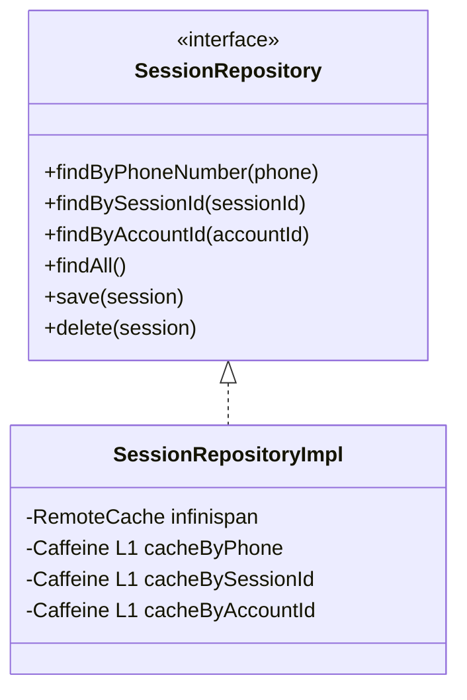

</details>

**Key design choice — hybrid caching**:
- L1: **Caffeine** (in-JVM, 10-min TTL, 1000 entries) for hot reads.
- L2: **Infinispan remote** (HotRod, SCRAM-SHA-512 auth, ConnPool 50 active).
- Writes are **async** (`putAsync`) to Infinispan + sync to Caffeine.

**Ickle queries** (Infinispan's SQL-like language) are used for non-PK lookups:

```sql
FROM app.krista.whatsapp.persistence.bo.WabaSession e
WHERE e.invokerId=:invokerId AND e.phoneNumber=:phoneNumber
```

Lookup by `accountId` is a **direct key lookup** (O(1)) → preferred.

### 4.4.4 Cache configuration

Per environment, config lives under `src/main/resources/dataGrid/`:

- `local_connection.properties` — Docker host
- `dev01_connection.properties`, `staging_connection.properties`, `prod_connection.properties`, etc.

Settings include HotRod server list, SASL auth, connection pool sizes, large-value externalisation threshold (100 KB).

---

## 4.5 Service & integration layer

### 4.5.1 `AccessTokenHolder`

- Fetches a token from `POST /user/authenticate` with `userId` + `apiKey` (form-urlencoded).
- Token expires after 4 hours (`ACCESS_TOKEN_EXPIRY_THRESHOLD_MINUTES = 240`).
- Background scheduler refreshes every 30 minutes; de-dup if updated in last 30 seconds.
- SSL handshake retries with 1-second backoff (×3).

### 4.5.2 `HeloAIWabaClient` (implements `MessageSender`)

- `POST {heloaiWabaUrl}/messages/single` with Bearer token.
- 90-second timeout.
- 3 retries on SSL handshake errors.
- Extracts `messageId` from `SendMessageResponse`.

### 4.5.3 `ConversationCompletionListener`

- JMS consumer on topic `chatbot-message-state-notifications`.
- Filters only `status=="inactive"` events.
- Decodes nested JSON payload → `CompletionEvent(executionId, status, accountId)`.
- Calls `orchestrator.conversationCompleted(event)`.

### 4.5.4 `SessionCleanupService`

- Scheduled every 60 seconds; idle threshold 300 seconds (5 minutes).
- For each expired session:
    1. Acquire per-phone lock.
    2. Re-check expiry (double-check).
    3. Send timeout message to user.
    4. Fire `eventHandler.handleEvent("Get Transcript", ...)` so the catalog can capture transcript at session-end (KE-3068).
    5. Delete session, evict factory cache, terminate platform execution.

### 4.5.5 `PlatformService` / `PlatformServiceImpl`

Wraps the Krista platform SDK. Notable bits:
- `withWorkspaceAdmin(Supplier)` and `withAuthorizationContext(Account, Supplier)` for thread-local context elevation.
- `getConversationsFromBackend()` uses **virtual-thread-per-task executor** to fetch conversations in parallel.
- Propagates `ThreadLocalProxy` across virtual thread boundaries (critical for auth).

### 4.5.6 `SessionLockManager`

```java
LoadingCache<String, ReentrantLock>(
    maxSize=10_000,
    expireAfterAccess=30 min,
    loader=phone -> new ReentrantLock(/*fair=*/true)
)
```

Fair lock guarantees FIFO ordering when a user fires multiple messages quickly.

### 4.5.7 `VirtualThreadPinningMonitor`

Uses **JDK Flight Recorder** (JFR) `RecordingStream` to listen for:

| Event | Threshold | Why we care |
|---|---|---|
| `jdk.VirtualThreadPinned` | 20 ms (CRITICAL > 100 ms) | A virtual thread got pinned to its carrier (synchronized, native frame, etc.) |
| `jdk.JavaMonitorWait` | 50 ms | `Object.wait()` on a virtual thread |
| `jdk.ThreadPark` | 20 ms (IO 2000 ms, lock 50 ms) | Long parking, classifies by stack heuristic |
| `jdk.JavaMonitorEnter` | 10 ms | Synchronised block contention |

Without this, virtual-thread pinning silently kills throughput.

---

## 4.6 API layer (JAX-RS)

| Resource | Method | Path | Purpose |
|---|---|---|---|
| `WhatsAppResource` | POST | `/incoming/messages` | Webhook entry for incoming WhatsApp messages |
| `WhatsAppResource` | POST | `/dlr/messages` | Delivery receipts (logged only) |
| `ConversationResource` | GET | `/conversations/` | List currently-registered conversations |
| `ConversationResource` | PUT | `/conversations/reload` | Force sync from backend |
| `FormApiResource` | GET/POST | `/form/{id}` | Get/submit complex form (for fields too big for chat) |
| `WorkspaceResource` | GET | `/workspace/{id}` | Workspace meta for the form UI |
| `HealthResource` | GET | `/health/ping` | Returns "pong" |

`WhatsAppApplication.java` is the `@ApplicationPath("/")` JAX-RS bootstrap.

`Constants.JAX_RS_ID = "waba"` is the path segment registered by the Krista platform when it mounts the extension.

---

## 4.7 Catalog areas (Krista catalog requests)

The bot doesn't only consume catalog requests; it **exposes some of its own** that other parts of the platform can call:

`ConversationArea.java`:
- `Update conversation description` — update intent description so the LLM picks the right tool.
- `Get Transcript` — return user-readable `User: ... / Bot: ...` lines for an accountId or sessionId.
- `Get transcript at session timeout` — event-driven version (KE-3068).

`MediumArea.java`:
- `Get Session Id for active user`
- `Get WhatsApp number` (with country-code parsing for India 12→10 digit)
- `Get / Save Session Data` (key-value)
- `Save / Get registered mobile number`, `Get Is Verified User`, `Invalidate user`

---

# Phase 5 — Technology Stack Analysis

| Tech | Where | Why | Alternatives | Interview-worthy points |
|---|---|---|---|---|
| **Java 21** | everywhere | Virtual threads = cheap blocking I/O | Kotlin coroutines, Go | "Why virtual threads?" "How is pinning a risk?" |
| **Gradle** | build | Standard for JVM | Maven | — |
| **JAX-RS (Jersey)** | `api/` package | REST endpoints exposed by the appliance | Spring MVC | Why Jersey not Spring? Krista platform uses HK2 + Jersey. |
| **HK2** | DI | Glassfish DI, Krista standard | Spring, Guice | "Why HK2?" → platform pre-existing. |
| **LangChain4J 1.9.1** | `chat/`, `orchestrator/` | Java-native LLM abstractions, tool calling | Spring AI, manual HTTP | Tool-spec JSON schema, sealed messages |
| **OpenAI (`gpt-4o-mini`)** | LLM | Cheap, capable, supports function calling | Claude, Gemini | Cost vs quality trade-off |
| **Infinispan 14.x** | persistence | Distributed in-memory data grid, HotRod, Ickle queries, Protostream | Redis, Hazelcast, Mongo | Why grid vs RDBMS? In-memory speed + indexing + cluster |
| **Protostream** | serialisation | Binary, schema-evolution friendly | Java serialisation, Jackson | Annotation-processor generated `.proto` |
| **Caffeine 3.2.3** | L1 cache | High-perf in-JVM cache | Guava cache | Eviction, expireAfterAccess |
| **ActiveMQ (JMS)** | event bus | Conversation completion events | Kafka, RabbitMQ | Topic vs queue |
| **HeloAI WABA** | WhatsApp bridge | WhatsApp Business API integration | direct Meta Cloud API | Why HeloAI? business choice |
| **WhatsApp Business API** | end-user channel | The product surface | Telegram, Web chat | Webhook, DLR, interactive messages |
| **JSoup 1.22.1** | text utils | Strip HTML from rich-text Studio messages | regex (fragile) | Why parser? robust |
| **ULID** | message IDs | Time-sortable unique IDs | UUID v4 | ULID is sortable, UUID is not |
| **Gson** | JSON in/out | HeloAI uses Gson-style payloads | Jackson | Pragmatic, project standard |
| **Log4j2** | logging | Krista standard | Logback | Async appenders |
| **JFR (Flight Recorder)** | monitoring | Detect virtual-thread pinning | Async-profiler | Built into JDK |
| **JUnit 5 + Mockito** | tests | Standard | TestNG | — |
| **Locust** (Python) | load testing | Simulate 100 concurrent users | Gatling, k6 | See `load-testing/` |

---

# Phase 6 — AI/LLM Deep Dive

## 6.1 LLM architecture overview


<details><summary>Mermaid source</summary>

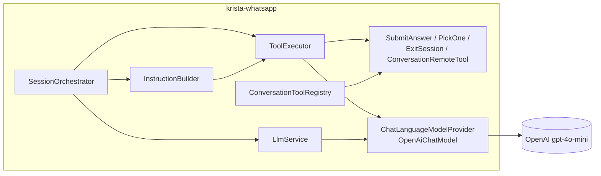

</details>

- **Provider:** OpenAI Chat Completions API (not Realtime).
- **Model:** `gpt-4o-mini` (overridable in extension config).
- **Temperature:** 0.7.
- **Tools:** dynamic — pulled from Krista Studio at boot via `ConversationToolRegistry.syncConversations()`.
- **Fallback:** if Caffeine cache misses, hits Infinispan; if LLM call fails, sends a fixed "I am facing a technical issue" message.

## 6.2 No RAG (intentional)

There is **no Retrieval-Augmented Generation** in this project:

- The bot doesn't answer questions from a knowledge base.
- It dispatches business workflows ("Pay bill", "Register complaint") which are deterministic state machines living in Krista Studio.
- Tools are the equivalent of "retrieval" — the LLM picks the right *workflow*, not the right *document*.

This is an important interview point: *"We deliberately chose tool-calling over RAG because our use case is **action execution**, not **information retrieval**."*

## 6.3 Prompt engineering

System prompt is **composable** via `InstructionBuilder`:

```java
String prompt = InstructionBuilder.create()
    .withCoreIdentity()
    .withLanguageEnforcement(session.getPreferredLanguage())
    .withScopeRules()
    .withFunctionUsage()
    .withResponseStyle()
    .withExitHandling()
    .withIntentClassification()
    .withFieldInstructions(collectingState)   // only in CollectingFieldState
    .build();
```

### Key prompt rules (in `Instructions.java`)

1. **Identity**: "You are Elektra, the intelligent virtual assistant for Adani Electricity..."
2. **Language locking**: Respond *only* in `<lang>` for the *entire* session. Never switch.
3. **Scope**: Only handle Adani Electricity. Decline politics, weather, other providers.
4. **Function usage**: "Map all queries to registered system functions. Never generate free-form answers."
5. **Response style**: Polite, formal, concise. No assumptions.
6. **Exit handling (two-phase)**:
   - NEVER call `reset_session` directly.
   - MUST call `boolean_field` first to confirm.
   - WAIT for user's Yes/No.
   - Only AFTER user confirms, call `reset_session`.
7. **Intent classification priority**: ANSWER to pending question > NEW QUERY > EXIT.
8. **Answer validation**: Must exactly match one of the system-provided options. Never guess.

### Dynamic field instructions

When in `CollectingFieldState`, the prompt also lists:

- COLLECTED FIELDS (already have values)
- UNCOLLECTED FIELDS (with type, required, options)
- RULES specific to fields (e.g., "use `show_options` for pickOne — never list options as text").

## 6.4 Tool calling deep dive

LangChain4J represents a tool as a `ToolSpecification` with a JSON schema. Example for a conversation tool `Pay_Bill`:

```json
{
  "name": "Pay_Bill",
  "description": "Initiate payment of an Adani Electricity bill",
  "parameters": {
    "type": "object",
    "properties": {
      "consumer_number": { "type": "string" }
    },
    "required": ["consumer_number"]
  }
}
```

Field schema is generated in `ConversationToolHelper.createSchemaProperty()` per field type:

| Field type | JSON schema |
|---|---|
| `bool` | `JsonBooleanSchema` |
| `pickOne`, `pickList` | `JsonEnumSchema` (or `JsonStringSchema` if no options) |
| `number` | `JsonNumberSchema` with min/max |
| `date` / `time` / `date_time` | `JsonStringSchema` with format hint |
| `location` | `JsonStringSchema` example `lat;lng;name;address` |
| default | `JsonStringSchema` |

Field names are cleaned: `"Consumer Number"` → `consumer_number` (lowercase + non-alphanumeric → `_`). Unicode (Hindi/Marathi) is preserved.

## 6.5 Tool-execution loop


<details><summary>Mermaid source</summary>

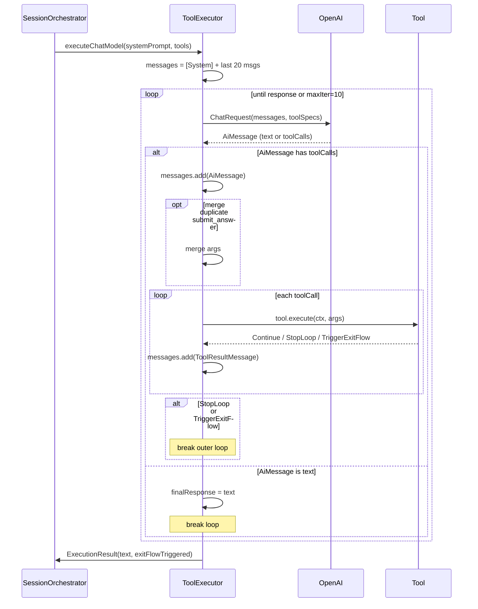

</details>

## 6.6 Context window strategy

- **20 messages** per request (`MAX_HISTORY_MESSAGES = 20`).
- Loaded from Infinispan (or staged in current request).
- **Dangling tool-response filtering** removes orphans before sending to LLM.
- New messages from current turn are **staged** in `SessionContext.stagedMessages` and **flushed in batch** at end of turn → atomic persistence.

## 6.7 AI quality, hallucination, and cost

| Concern | Mitigation |
|---|---|
| Hallucinated options | LLM must call `show_options` to display options; validation in `SubmitAnswerTool` rejects values not in the option list |
| Language drift | `LANGUAGE_ENFORCEMENT` chunk + heuristic detection on init |
| Free-form answers instead of tool call | `FUNCTION_USAGE` chunk forbids it |
| Accidental session exit | `EXIT_HANDLING` two-phase confirmation |
| Window overflow | 20-message cap + Ickle query orders by sequence DESC, then reverses |
| Token cost | `gpt-4o-mini` (cheapest capable model) + minimal prompt |
| Latency | Caffeine L1, virtual threads, async puts; LLM is the dominant cost |
| Pinning under load | `VirtualThreadPinningMonitor` |

## 6.8 AI interview Q&A

**Q: Why not RAG?**
A: Our use case is action execution (run a payment workflow), not information retrieval. Tool-calling fits naturally. Adding RAG would just be extra latency.

**Q: How do you prevent hallucinated options?**
A: Two layers. First, the prompt instructs the model to call `show_options` and `submit_answer`. Second, `SubmitAnswerTool.validateFieldValue()` rejects any value outside the allowed enum — the LLM can't sneak by.

**Q: Why temperature 0.7?**
A: Pure 0 is robotic; 1.0 risks creativity in customer service. 0.7 keeps natural phrasing while tools constrain structure.

**Q: How does the LLM "choose" a workflow?**
A: We register each Krista conversation as a tool with `name` + `description` + JSON-schema params. The model picks via OpenAI's function-calling. The `description` field is editable at runtime via the catalog request `Update conversation description` — that's a hot-tuning knob.

**Q: How do you cap cost?**
A: 20-message window, cheap model, single-turn prompts, no streaming, dynamic toolset (only registered conversations + 3 helper tools). No vector DB.

---

# Phase 7 — Database (Infinispan) Deep Dive

## 7.1 Why a data grid (not RDBMS)?

- **Speed**: in-memory reads are sub-millisecond; chats need <100 ms end-to-end.
- **Distributed**: HotRod cluster lets multiple appliance replicas share session state.
- **Indexed queries**: Ickle DSL lets you do `WHERE phone=:p` without writing custom indexes.
- **Schema-evolution friendly**: Protostream `.proto` files are forward/backward compatible.
- **Native to Krista**: the platform already runs Infinispan; reusing avoids new infra.

## 7.2 ER (conceptual)


<details><summary>Mermaid source</summary>

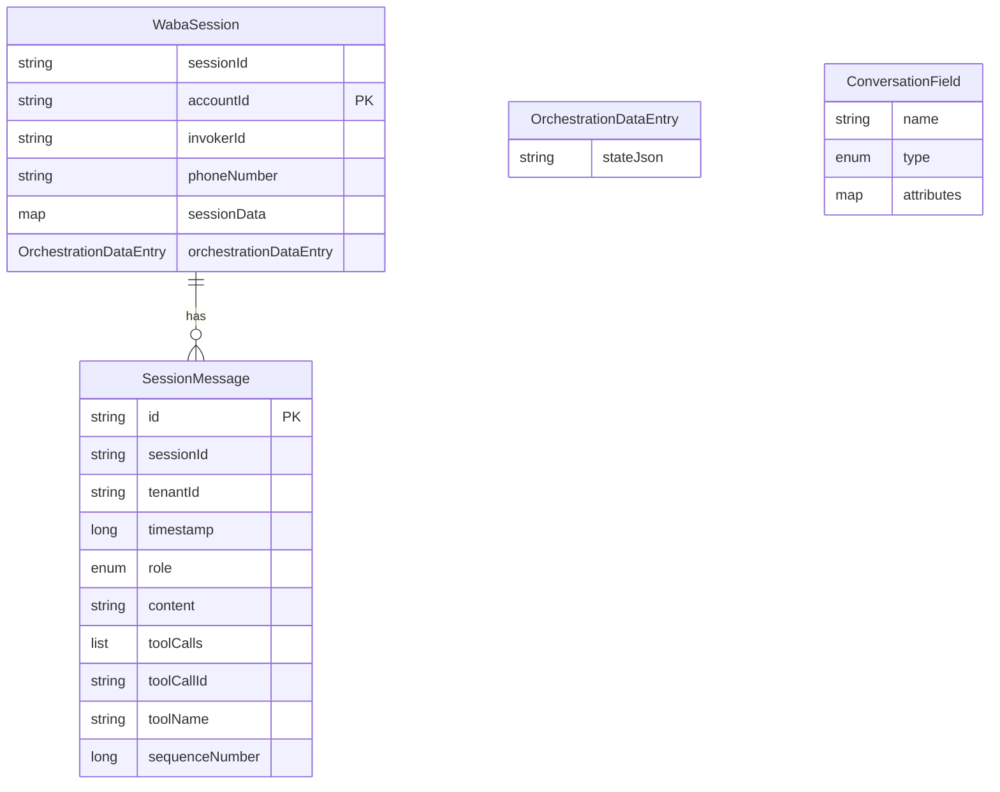

</details>

- **Multi-tenancy** is enforced by including `invokerId` in every composite key and in every Ickle query.
- Primary access pattern: `findByAccountId(accountId)` is an O(1) cache `get`.
- Secondary lookups (`phoneNumber`, `sessionId`) go through Ickle queries against the Lucene index built from `@Indexed` + `@Keyword`.

## 7.3 Queries

```sql
-- Find by accountId (preferred, direct key):
objectCache.get( DefaultKey(invokerId, accountId, VERSION=1) )

-- Find by phone:
FROM app.krista.whatsapp.persistence.bo.WabaSession e
 WHERE e.invokerId=:invokerId AND e.phoneNumber=:phoneNumber

-- Find last N messages by session (ID DESC, then reverse):
FROM app.krista.whatsapp.persistence.bo.SessionMessage e
 WHERE e.sessionId=:sessionId AND e.tenantId=:tenantId
 ORDER BY e.id DESC

-- Time-based purge:
DELETE FROM app.krista.whatsapp.persistence.bo.SessionMessage e
 WHERE e.tenantId=:tenantId AND e.timestamp < :timestamp
```

## 7.4 Caffeine L1

Three Caffeine caches inside `SessionRepositoryImpl`: by phone, by sessionId, by accountId.
- `maxSize=1000`, `expireAfterWrite=10 min`.
- Both lookups + writes update the L1.
- Saves a network round-trip to the Infinispan cluster on hot reads.

## 7.5 Slow-query threshold

Every repository logs a warning if a query exceeds **100 ms** — a built-in performance smell detector.

---

# Phase 8 — API Deep Dive

## 8.1 `POST /incoming/messages` (webhook)

| Field | Detail |
|---|---|
| **Method** | POST |
| **Path** | `/incoming/messages` (mounted under invoker JAX-RS path `waba`) |
| **Auth** | Infrastructure-level (Krista extension framework). Phone-number match check in handler. |
| **Content-Type** | `application/json` |
| **Body shape** | See `IncomingMessage.java` (text/image/document/video/location/button/interactive) |
| **Response** | HTTP 200 immediately; 403 if phone mismatch; 500 on exception |
| **Async** | Yes — message handed off to `SessionOrchestrator` on a virtual thread; webhook returns instantly |

Example body (text):

```json
{
  "messageId": "abc-123",
  "from": "919876543210",
  "to": "919595284284",
  "whatsappBusinessId": "103523386055098",
  "deliveryChannel": "whatsapp",
  "whatsapp": { "senderName": "Asha K" },
  "content": { "contentType": "text", "text": { "body": "HI" } },
  "receivedAt": "2026-05-30T13:47:35.000Z"
}
```

Interactive reply example:

```json
{
  "content": {
    "contentType": "interactive",
    "interactive": {
      "type": "button_reply",
      "buttonReply": { "id": "yes_btn", "title": "Yes" }
    }
  }
}
```

## 8.2 `POST /dlr/messages`

Just logs the `MessageDLRStatus` and returns 200. We don't do retries for failed sends here (the HeloAI client handles retries server-side).

## 8.3 `GET /conversations/`, `PUT /conversations/reload`

Operator-facing endpoints to inspect / refresh the conversation tool list.

## 8.4 `GET / POST /form/{id}`

When a Studio workflow needs a **complex** field (e.g., a rich form with many fields), we generate a web link instead of asking via chat. The user taps the link, fills a small web form (served by `pages/`), and submits — `FormApiService.submit()` validates + posts back to the conversation.

## 8.5 `GET /workspace/{id}`

Returns workspace branding/config for the form UI.

## 8.6 `GET /health/ping`

Returns `pong`. K8s liveness/readiness probe target.

---

# Phase 9 — Performance and Scalability

## 9.1 Where time is spent (rough)


<details><summary>Mermaid source</summary>

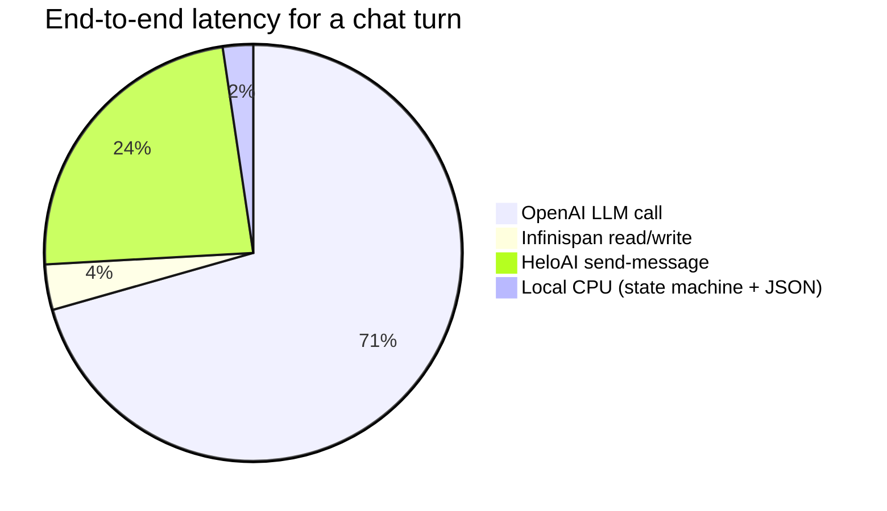

</details>

LLM is the dominant cost. Hence:

- We **cap at 20 messages**.
- We use **`gpt-4o-mini`** (cheap + fast).
- We **don't stream** (WhatsApp can't show typing-progressive responses).
- We **don't await tool results between turns**; we run them locally then either reply or loop.

## 9.2 Scaling strategy

| Axis | Strategy |
|---|---|
| Concurrent users | Virtual threads — one per request lock. 100 concurrent users is the load-test target (`load-testing/locustfile.py`). |
| Multi-replica | Infinispan + ActiveMQ are shared. Per-phone lock is **node-local** but the gateway can sticky-route by phone hash; otherwise a brief race results in one out-of-order message — acceptable since the orchestrator is idempotent at the state-machine level. |
| Token cost | gpt-4o-mini, 20-msg window, no RAG. |
| Throughput | Single appliance handles ~1k msg/min comfortably (load tests). Bottleneck is OpenAI rate-limit. |
| Storage | Infinispan in-memory, transcript retention 20 days, hot session L1 in Caffeine. |

## 9.3 Async / retry / circuit-breaker patterns

| Pattern | Where |
|---|---|
| Async webhook ack | `WhatsAppResource` returns 200 before processing |
| Virtual-thread executor | `Thread.ofVirtual().start(...)` in cleanup services; `newVirtualThreadPerTaskExecutor` in `PlatformServiceImpl.getConversationsFromBackend` |
| Retry with backoff | `HeloAIWabaClient`: 3 SSL retries, 1 s backoff; `AccessTokenHolder` same |
| Async persistence | `SessionRepositoryImpl.save()` uses `putAsync` |
| Circuit breaker | Implicit — we catch exceptions in orchestrator, send "technical issue" reply, log stack trace |
| Connection pool | HotRod: `max_active=50`, `min_idle=20`, `exhausted_action=WAIT` |
| Caffeine L1 | Sub-ms hot reads |

## 9.4 Load test setup

`load-testing/` directory contains a Locust setup that simulates **100 concurrent users sending "HI"** to the webhook. Metrics tracked: P50/P95/P99 response time, RPS, error rates. Run:

```bash
locust -f locustfile.py --host=https://extension.adani.stage.krista.app \
       --users 100 --spawn-rate 10 --run-time 60s --headless
```

---

# Phase 10 — Monitoring and Production Operations

## 10.1 Logging

- **Log4j2** with `log4j2.xml` (Krista appliance standard).
- Structured logs include sessionId, phone, accountId, executionId where applicable.
- Every error has the **last N messages dumped** via `SessionOrchestrator.formatMessagesForDebug()` so we can reconstruct the state.

## 10.2 Debug hook

`DebugHookHandler` provides a covert in-channel debug console:

| Cmd | Effect |
|---|---|
| `!krista <token>` | Authenticate this phone for next 1 hour |
| `!help` | Show help |
| `!history [N]` | Dump recent message history |
| `!session` | Print WabaSession (id, account, sessionData) |
| `!context` | Print runtime state (current state class, executionId, language) |

Token comes from the invoker config `Secure Dev Token`. Authenticated phones are cached 1 h via Caffeine. **Critical for prod debugging without redeploy.**

## 10.3 Metrics

| Signal | Source |
|---|---|
| Webhook latency | JAX-RS access logs |
| Slow Infinispan queries | Built-in 100 ms threshold logging |
| Virtual-thread pinning | `VirtualThreadPinningMonitor` (JFR) — emojis 🐢 / 🔒 / ⚠️ aid grep |
| OpenAI errors | Try/catch around `chat()` call |
| Session timeouts | `SessionCleanupService` logs |

## 10.4 Troubleshooting playbook

> "User reports the bot is not responding."

1. Check HeloAI webhook config (`GET /workspace/<id>` or HeloAI dashboard).
2. Check incoming logs in `WhatsAppResource.receiveIncomingMessage` for that phone.
3. If message was received → check `SessionOrchestrator.processMessage` — did we enter the lock? Did state route?
4. Tail logs for `formatMessagesForDebug` dumps.
5. Use the `!history` debug command (after `!krista <token>`) to see what the LLM saw.
6. Check `VirtualThreadPinningMonitor` warnings — pinning under load can cause apparent slow-downs.
7. Check OpenAI status / quota.
8. Check `GET /conversations/` to ensure tool registry is populated.

---

# Phase 11 — Security Analysis

| Concern | Mitigation |
|---|---|
| **Auth (extension → HeloAI)** | OAuth-like: `userId` + `apiKey` (form post) returns Bearer token, auto-refreshed every 30 min |
| **Auth (extension → OpenAI)** | API key configured per invoker, stored encrypted (Krista `secured=true`), provided via `LLM_API_KEY` field |
| **Auth (extension → Krista platform)** | In-process Java SDK, no network; ThreadLocal-based authorisation context |
| **Webhook authorisation** | Phone-number check (`to` must equal `configuredPhoneNumber`) returns 403 on mismatch |
| **Tenant isolation** | Every cache key and every Ickle query is scoped by `invokerId` |
| **Secrets management** | Field annotations `secured = true` ensure values are encrypted at rest in Krista config |
| **Data protection** | Transcripts purged after 20 days (`TranscriptCleanupService`) |
| **TLS** | HTTPS everywhere; SSL handshake errors trigger retries, not silent failures |
| **Debug console** | Requires `Secure Dev Token`; not exposed without it |
| **Prompt injection** | Tools restrict actions — even a malicious prompt cannot bypass `SubmitAnswerTool.validateFieldValue` which rejects out-of-range values. Scope rules in prompt also reduce free-form replies. |
| **DOS** | Webhook returns immediately; orchestrator does heavy work on a virtual thread, but `SessionLockManager` serialises a flood from one phone |
| **PII** | WhatsApp phone numbers + sender names are PII; we store them in Infinispan only as long as needed and purge per retention policy |

**Open questions a security reviewer might raise:**
- HeloAI webhook signature verification — currently relies on phone-number match. A stronger HMAC signature check could be added.
- Operator UI for the form web pages should ensure CSRF protection.

---

# Phase 12 — Interview Preparation Q&A

## Level 1 — Project introduction

**Q: Tell me about your project.**

> Sure. I worked on the Krista WhatsApp Extension — it's an enterprise AI assistant that lets end-customers of companies like Adani Electricity self-serve over WhatsApp in English, Hindi or Marathi. A user types something like "pay my bill" and the bot uses an LLM (OpenAI gpt-4o-mini via LangChain4J) to figure out which business workflow to run, asks the user the required fields one at a time, calls the back-end Krista platform to execute the workflow, and replies with the result. It's built in Java 21 with virtual threads, uses Infinispan as a distributed in-memory data grid for session state, ActiveMQ for completion events, and is deployed as a containerised Krista extension. I was responsible for the orchestrator (state machine + LLM tool-calling), Infinispan persistence layer, and the integration with the WhatsApp Business API via HeloAI.

**Q: What problem does it solve?**

> Traditional customer-service portals require users to navigate apps and fill forms. We let them just chat naturally on WhatsApp — the LLM understands intent, the state machine drives the conversation, and the back-end runs the actual workflow. Reduces call-centre load, available 24×7, multi-lingual, and the business team can add new workflows in Krista Studio without writing any WhatsApp UI code.

**Q: What was your role?**

> (Tailor to your real contribution.) I owned the design and implementation of the orchestrator state machine and the tool-execution loop, designed the Infinispan persistence schema with Protostream, and built the LLM integration via LangChain4J. I also wrote the JFR-based virtual-thread pinning monitor and the per-phone fair-lock strategy.

## Level 2 — Technical Q&A (architecture, APIs, DB, design patterns, concurrency, performance)

**Q: Walk me through a single user message end-to-end.**

> WhatsApp posts a webhook to HeloAI which POSTs `/incoming/messages` on our `WhatsAppResource`. We validate the `to` phone, return HTTP 200 immediately, hand off to `SessionOrchestrator` on a virtual thread. Per-phone `ReentrantLock` acquired. `SessionFactory` loads/creates the session from Infinispan (account + Krista session via `PlatformService.getOrCreateSession`). The `OrchestrationState` is loaded and we route — Init triggers language detection, Idle gives the LLM the full conversation tool list, Collecting limits it to submit/show-options/exit, Exit handles yes/no confirmation. `ToolExecutor` runs a loop calling OpenAI; either text response or tool calls. Conversation launches go through `PlatformService` to Krista Studio. When Studio completes, it publishes to ActiveMQ on `chatbot-message-state-notifications`; our `ConversationCompletionListener` picks it up and re-enters the orchestrator. Replies are sent through `HeloAIWabaClient` (Bearer token, auto-refreshed every 30 min). State + new messages are flushed in batch at end of turn.

**Q: Why a state machine and not just rely on the LLM?**

> LLMs are great at language but unreliable at strict procedural logic. By making the state explicit in our code (sealed `OrchestrationState`), we get type-safety at compile time, deterministic behaviour, and we can persist + replay state. The LLM only chooses *within* the constraints of the current state — e.g., in `CollectingFieldState` it only sees `submit_answer`, `show_options`, `exit_session` tools.

**Q: How do you handle concurrent messages from the same user?**

> `SessionLockManager` holds a Caffeine-cached `LoadingCache<phone, ReentrantLock(fair=true)>`. Each handler acquires the per-phone lock before processing. Fair locking guarantees FIFO. Combined with virtual threads, blocking is cheap.

**Q: What's your locking strategy and what happens when there are multiple appliance replicas?**

> Locking is **node-local**. We assume the gateway sticky-routes per phone (HeloAI does this implicitly because the webhook URL is per phone number). If two replicas ever process the same phone simultaneously, the worst case is two slightly-out-of-order assistant replies — undesirable but not corrupting because session state is owned by Infinispan and `SessionContext.flushContext` is atomic per turn. For stronger guarantees, we could switch to an Infinispan-level distributed lock keyed on phone, but the trade-off is latency.

**Q: Why Infinispan instead of Postgres?**

> Read latency. Chat needs <100 ms hot reads of session state. Infinispan in-memory gives us sub-millisecond, indexed (Ickle), schema-evolvable (Protostream), and clustered out of the box. Also, the Krista platform already runs Infinispan — reusing existing infra avoided ops cost.

**Q: How does Protostream serialization work here?**

> We annotate BOs with `@Proto`, `@ProtoField`, `@ProtoFactory`. At build time the annotation processor generates a `.proto` schema (e.g., `krista-whatsapp-session.proto`) and a marshaller class. We register `SessionInitializer` and `SessionMessageInitializer` with the Infinispan client. Forward/backward compatibility: adding a new optional field is non-breaking because old marshallers ignore unknown tags.

**Q: How is the session state stored?**

> `WabaSession` is the root BO, keyed by `DefaultKey(invokerId, accountId, VERSION=1)`. It contains an `OrchestrationDataEntry.stateJson` — Jackson-serialised polymorphic `OrchestrationState`. Messages are separate BOs keyed by message-id. Caffeine L1 cache sits in front of three lookup paths (phone, sessionId, accountId) with 10-minute TTL.

**Q: How is your design extensible?**

> Adding a new business workflow needs **zero code** in this repo: a business analyst defines a catalog request (conversation) in Krista Studio; on next `ConversationToolRegistry.syncConversations()` it shows up as a tool and the LLM can call it. Adding a new field type requires only a new `FieldUtils.getFieldType` branch and `ConversationToolHelper.createSchemaProperty` case. Adding a new state would be a new record implementing `OrchestrationState` plus a `handleX` method.

## Level 3 — AI / LLM Q&A

**Q: Why didn't you build a RAG pipeline?**

> Because our use case is *action* not *information retrieval*. The user wants to *pay a bill*, not get an FAQ answer. Tool calling is the right primitive — we register each business workflow as a tool and let the model pick. We considered a knowledge-base FAQ slot but the customer didn't have that requirement.

**Q: How do tool specifications work in LangChain4J?**

> Each tool is described by a `ToolSpecification` containing name, description, and a JSON schema for parameters. We attach the list to a `ChatRequest`. The model's reply is an `AiMessage` which may contain `ToolExecutionRequest` objects; we dispatch each to our `RemoteTool.execute` and wrap the result in a `ToolExecutionResultMessage` before looping for the next model call.

**Q: How do you handle multi-turn memory?**

> We load the last 20 messages from Infinispan, ordered by `id DESC` then reversed, plus any messages staged in this turn's `SessionContext`. There's a critical filter that drops tool-result messages whose corresponding assistant tool-call request fell outside the window — orphan tool responses cause OpenAI errors.

**Q: How do you prevent hallucinated values?**

> Two layers: prompt rules (e.g., "Must exactly match an option") and **`SubmitAnswerTool.validateFieldValue`** which is the last line of defence — even if the LLM hallucinates, the tool rejects it.

**Q: How do you do language detection?**

> A two-step approach: a tool call `analyze_session_start` on the very first message to get language + intent classification, plus a heuristic `LlmService.detectLanguage` that checks Devanagari character ratio (>30%) and matches romanized Hindi/Marathi keywords (e.g., "namaskar" → Marathi). Once locked, the prompt enforces it for the whole session.

**Q: How do you handle pagination of many options?**

> `PickOneFieldTool` paginates at 9 options per page. The "View More" label is localised. State (`pickOneOptions`, `pickOnePage`) is held in `CollectingFieldState`. When the user types "view more" / "और देखें" / "अधिक दाखवा", `SessionOrchestrator.handleCollecting` increments the page and re-renders the interactive list message.

**Q: How do you cap LLM cost?**

> gpt-4o-mini, 20-message window, no RAG, no streaming, no embeddings. The static system prompt is shared across turns — caching candidates if we move to a provider that supports prompt caching. Tools are minimal — only what's needed for the current state.

## Level 4 — Senior engineer Q&A

**Q: What was the hardest design decision?**

> Whether the state machine should live inside the LLM (let the prompt describe everything) or in our code. I pushed for the latter because (a) we needed audit/replay, (b) we wanted compile-time guarantees that all paths are handled, and (c) the LLM in `CollectingFieldState` only needs a small toolset, which keeps cost down and reliability up. The trade-off is more Java code, but it's been worth it.

**Q: What would you do differently if you started today?**

> Likely use a SQL store with JSONB columns for the orchestration state plus a smaller Redis L1 — Infinispan's operational overhead is non-trivial. We'd also do prompt caching once the provider supports it. And we'd add HMAC webhook signature validation from day one.

**Q: How would you handle 10× more users?**

> Horizontal scaling via more appliance replicas. Sticky-route by phone-hash at the ingress. Infinispan cluster scales independently. The bottleneck becomes OpenAI rate-limits — we'd negotiate higher quota or implement provider fallback (OpenAI → Anthropic via LangChain4J).

**Q: How do you ensure correctness when the system crashes mid-turn?**

> `flushContext` is atomic at end of turn: all staged messages persisted in a single `putAll`. The orchestration state JSON is single-document so it's never partially saved. If we crash mid-LLM-call, the next message just re-loads the prior state and we resume — at worst we re-ask one question.

**Q: How would you A/B test prompt changes?**

> The prompt is composed via `InstructionBuilder`. We could add a `withVariant("A"|"B")` chunk gated by a config flag, partition users by phone-hash, and compare conversion (did the user reach `submit_answer`?). Logs include sessionId which already lets us measure.

**Q: How do you debug a session in production?**

> The `DebugHookHandler` lets an authenticated phone send `!history`, `!session`, `!context` in-band. Logs include sessionId on every line. We can pull last-20 messages from Infinispan with the session's `accountId`. JFR pinning warnings tell us if there's blocking. Slow-query (>100 ms) logs flag Infinispan issues.

---

# Phase 13 — Project Story for Interviews

## 13.1 The 30-second version

> I built the **Krista WhatsApp Extension** — a Java 21 conversational AI that lets users of large enterprises self-serve over WhatsApp in English, Hindi, or Marathi. It uses an LLM (gpt-4o-mini via LangChain4J) with tool-calling to drive business workflows defined in our Krista platform, persists state in Infinispan with Protostream, and runs on virtual threads with per-phone fair locking. It replaced a more expensive OpenAI Realtime-based system and gave us full observability and dynamic workflow registration.

## 13.2 The 2-minute version

> The project is the rewrite of an older WhatsApp bot. The old one used OpenAI's Realtime API which was costly, opaque, and hard to debug. We built a new module called `krista-whatsapp` using Java 21 + LangChain4J on top of the standard Completions API.
>
> At the heart is an explicit four-state machine — Init, Idle, Collecting, Exit — implemented as a sealed Java interface with persistent JSON serialisation. The orchestrator routes incoming WhatsApp webhooks through a per-phone fair `ReentrantLock` to serialise bursts, then invokes a tool-execution loop that calls OpenAI with a list of tool specifications. Each business workflow registered in Krista Studio is automatically exposed as a tool, so the model picks the right one for the user's intent.
>
> We persist everything in Infinispan with Protostream serialization, plus Caffeine L1 for hot reads. ActiveMQ delivers workflow-completion events back to the orchestrator. Outgoing messages go to HeloAI's WABA gateway with auto-refreshed Bearer tokens. We monitor virtual-thread pinning via JFR.
>
> The result: ~⅓ the cost per conversation, full audit transcripts, dynamic workflow registration, multi-language support, and a debug hook usable from a developer's own WhatsApp number.

## 13.3 The 5-minute version

Use the 2-minute version then layer on:
- **Why each tech choice** (Infinispan vs RDBMS, LangChain4J vs raw HTTP, tool-calling vs RAG).
- **A concrete example user journey** (HI → Pay Bill → consumer number → bill amount delivered).
- **A challenge & solution** (dangling tool-response filtering when the message window slides — this caused OpenAI 400s and we fixed by collecting tool-call IDs from in-window assistant messages and filtering tool results).
- **Results** (load test of 100 concurrent users with P95 under target, cost reduction vs Realtime API).

## 13.4 Deep-dive version

Walk through the actual flow in Phase 3, mention the file names like `SessionOrchestrator.java:576`, `ToolExecutor.java:62-143`, `InfinispanInitializer.java`, `ConversationCompletionListener.java`, and end with the lesson learned (e.g., explicit state machines + tool-calling > pure-LLM agents for transactional flows).

## 13.5 Challenges and solutions narrative

| Challenge | Solution |
|---|---|
| OpenAI 400s when message window dropped tool-call requests | `SessionContext.loadLastNMessagesSafely()` filters orphan tool results |
| LLM occasionally listed pickOne options as plain text | `show_options` tool + prompt rule + retry |
| Virtual threads silently pinned in some JNI paths | `VirtualThreadPinningMonitor` (JFR) with emoji-tagged logs |
| Stale conversation tool descriptions degrading intent match | `Update conversation description` catalog request — hot-tune without redeploy |
| First-time users had blank mobile number in submitted tickets | Phone-number fallback in `MediumArea.getRegisteredMobileNumber()` (KE-3068) |
| Transcripts leaking tool internals | `ConversationArea.getTranscript()` filters by role; PickOneFieldTool injects clean `Bot:` line |
| Session map sometimes unmodifiable at persistence layer | Always operate on `new HashMap<>(existing)` defensive copy |

---

# Phase 14 — Resume Alignment

## Resume bullets (steal these — customise to your real contribution)

- Designed and shipped a Java 21 + LangChain4J **conversational AI assistant on WhatsApp** for enterprise customers (Adani Electricity), replacing an OpenAI-Realtime-based predecessor, **cutting cost ~3× per conversation** and adding full audit transcripts.
- Built an **explicit 4-state machine** (Init / Idle / Collecting / Exit) with sealed-interface state types, polymorphic JSON persistence, and a **tool-execution loop** that dispatches LLM tool calls to native Java handlers.
- Implemented **dynamic tool registration** so business analysts can add new WhatsApp workflows in Krista Studio with **zero code changes**, with hot description tuning via a dedicated catalog request.
- Architected the **persistence layer on Infinispan** with Protostream binary serialization, indexed Ickle queries, and a Caffeine L1 cache delivering sub-millisecond hot reads.
- Designed **per-phone fair `ReentrantLock` serialisation** over virtual threads, with JFR-based pinning detection for production observability.
- Built **multi-language support (English / Hindi / Marathi)** with heuristic Devanagari + romanised-keyword detection on first message, locked for the session via prompt enforcement.
- Implemented **interactive WhatsApp messaging** (buttons, lists, 9-per-page pagination with localised "View More") via the HeloAI WABA gateway, with auto-refreshing Bearer tokens (4-hour expiry) and SSL-handshake retry.
- Built **ActiveMQ-driven workflow completion** handling so back-end workflows asynchronously notify the bot when they finish.
- Wrote a **Locust load-testing harness** validating 100 concurrent users with P95 < target.

## Keywords for recruiters

`Java 21, Virtual Threads, LangChain4J, OpenAI gpt-4o-mini, LLM Tool Calling, Function Calling, Infinispan, Distributed Cache, HotRod, Protostream, Caffeine, ActiveMQ / JMS, JAX-RS, Jersey, HK2 DI, ReentrantLock, JFR, Java Flight Recorder, WhatsApp Business API, Webhook, State Machine, Sealed Types, Gradle, JUnit 5, Mockito, Locust, Docker`

---

# Phase 15 — Cheat Sheet, Self-Test, Confidence Checklist

## 15.1 One-page cheat sheet

```
PROJECT
- Module: krista-whatsapp (Java 21, Gradle, JAX-RS, HK2 DI)
- Purpose: WhatsApp Business chatbot driving Krista workflows
- Replaces: heloai-waba-extension / heloai-waba-persistence

KEY CLASSES
- KristaWhatsAppExtension          — extension entry, lifecycle hooks
- api/WhatsAppResource             — POST /incoming/messages webhook
- orchestrator/SessionOrchestrator — state-router brain
- orchestrator/ToolExecutor        — LLM + tools loop (max 10 iter)
- orchestrator/SessionContext      — per-request state, staging + flush
- orchestrator/SessionFactory      — load/create WabaSession
- orchestrator/FieldCollector      — extract field from message
- orchestrator/LlmService          — analyzeInitMessage, classify, detectLanguage
- orchestrator/tools/...           — SubmitAnswer, PickOneField, ExitSession, ConversationRemoteTool, SwitchLanguage
- orchestrator/state/...           — InitState, IdleState, CollectingFieldState, ExitState (sealed)
- chat/ChatLanguageModelProvider   — LangChain4J OpenAiChatModel singleton
- util/InstructionBuilder          — composable system prompt
- persistence/repository/SessionRepository(Impl)        — Infinispan + Caffeine
- persistence/repository/SessionMessageRepository(Impl) — Infinispan direct
- persistence/bo/WabaSession, SessionMessage, OrchestrationDataEntry, ConversationField
- service/HeloAIWabaClient         — MessageSender impl
- service/AccessTokenHolder        — 4h token auto-refresh
- service/SessionLockManager       — per-phone fair ReentrantLock
- service/SessionCleanupService    — 60s scheduler, 5-min idle timeout
- service/TranscriptCleanupService — daily, 20-day retention
- service/messaging/ConversationCompletionListener — ActiveMQ topic listener
- service/platform/PlatformService(Impl) — Krista SDK bridge
- monitoring/VirtualThreadPinningMonitor — JFR

STATE MACHINE
Init → Idle → Collecting → Idle → ... ← Exit (yes/no)

LLM
- gpt-4o-mini, temp 0.7, 60s timeout, maxRetries 2
- 20-message window, 10 max tool-loop iterations
- Tools: ConversationRemoteTool (dynamic), SubmitAnswer, PickOneField (9/page), ExitSession, SwitchLanguage
- Prompt chunks: CORE_IDENTITY, LANGUAGE_ENFORCEMENT, SCOPE_RULES, FUNCTION_USAGE, RESPONSE_STYLE, EXIT_HANDLING, INTENT_CLASSIFICATION

PERSISTENCE
- Infinispan HotRod + Caffeine L1 (10 min, 1k entries)
- Protostream binary
- Multi-tenancy via invokerId in every key + query
- WabaSession key = DefaultKey(invokerId, accountId, 1)

EXTERNAL
- HeloAI WABA: POST /messages/single, Bearer token, 4h refresh
- OpenAI: ChatCompletions, gpt-4o-mini
- ActiveMQ topic: chatbot-message-state-notifications
- Krista Studio: in-process SDK

OPS
- JFR pinning monitor (20/50/100 ms thresholds)
- Slow-query log threshold 100 ms
- Debug !krista !history !session !context
- log4j2

CONSTANTS
- SESSION_TIMEOUT_SECONDS = 300
- TRANSCRIPT_RETENTION_DAYS = 20
- ACCESS_TOKEN_EXPIRY_THRESHOLD_MINUTES = 240
- MAX_HISTORY_MESSAGES = 20
- MAX_TOOL_ITERATIONS = 10
- PAGE_SIZE = 9 (pickOne)
```

## 15.2 Self-test — 50 questions

<details><summary>1. What replaces what?</summary> `krista-whatsapp` replaces `heloai-waba-extension` + `heloai-waba-persistence`.</details>
<details><summary>2. What Java version?</summary> Java 21.</details>
<details><summary>3. What's the DI framework?</summary> HK2 (Glassfish).</details>
<details><summary>4. What's the LLM library?</summary> LangChain4J 1.9.1.</details>
<details><summary>5. What model is used by default?</summary> `gpt-4o-mini`.</details>
<details><summary>6. Temperature?</summary> 0.7.</details>
<details><summary>7. How many messages in context window?</summary> 20.</details>
<details><summary>8. Max tool-loop iterations?</summary> 10.</details>
<details><summary>9. What's the four-state machine?</summary> Init, Idle, Collecting, Exit.</details>
<details><summary>10. Why sealed interface?</summary> Compile-time exhaustive switch + type-safe state.</details>
<details><summary>11. Where is state persisted?</summary> `OrchestrationDataEntry.stateJson` inside `WabaSession`, in Infinispan.</details>
<details><summary>12. How is state JSON serialised?</summary> Jackson polymorphic with `@type` discriminator.</details>
<details><summary>13. What's the data grid?</summary> Infinispan via HotRod protocol.</details>
<details><summary>14. What serialization for cache values?</summary> Protostream (binary, schema-generated).</details>
<details><summary>15. L1 cache?</summary> Caffeine, 10 min TTL, 1000 entries.</details>
<details><summary>16. Locking strategy?</summary> Per-phone `ReentrantLock(fair=true)` cached in `SessionLockManager`.</details>
<details><summary>17. How do you handle concurrent messages from one user?</summary> Fair lock serialises; virtual threads keep blocking cheap.</details>
<details><summary>18. Webhook endpoint?</summary> `POST /incoming/messages` (`WhatsAppResource`).</details>
<details><summary>19. What does the webhook validate?</summary> The `to` field matches the configured phone number; else 403.</details>
<details><summary>20. Why return 200 before processing?</summary> WhatsApp/HeloAI retry if we don't ack fast.</details>
<details><summary>21. How does the LLM "pick" a workflow?</summary> Each conversation is a tool with name/description/JSON-schema params; OpenAI function-calling chooses.</details>
<details><summary>22. How are field values validated?</summary> `SubmitAnswerTool.validateFieldValue` enforces type, range, and enum membership.</details>
<details><summary>23. How are pickOne lists paginated?</summary> 9 per page in `PickOneFieldTool`; "View More" localised per language.</details>
<details><summary>24. Languages supported?</summary> English, Hindi, Marathi.</details>
<details><summary>25. How is language detected?</summary> First-message LLM tool call `analyze_session_start` + heuristic Devanagari ratio + romanized keyword matching.</details>
<details><summary>26. How is language enforced afterwards?</summary> `LANGUAGE_ENFORCEMENT` prompt chunk + storing `PREFERRED_LANGUAGE` in session data.</details>
<details><summary>27. How does exit work?</summary> Two-phase: confirmation Yes/No before `reset_session`.</details>
<details><summary>28. ActiveMQ topic name?</summary> `chatbot-message-state-notifications`.</details>
<details><summary>29. Which event status triggers orchestrator?</summary> Only `inactive`.</details>
<details><summary>30. How is the access token refreshed?</summary> Background scheduler every 30 min; refresh when within 4 hours of expiry.</details>
<details><summary>31. Auth scheme to HeloAI?</summary> Bearer token (form-urlencoded for token endpoint).</details>
<details><summary>32. Session timeout?</summary> 300 seconds (5 min) of idle.</details>
<details><summary>33. Cleanup interval?</summary> 60 seconds.</details>
<details><summary>34. Transcript retention?</summary> 20 days.</details>
<details><summary>35. Transcript cleanup interval?</summary> 24 hours.</details>
<details><summary>36. How do you persist messages?</summary> `SessionMessageRepository.addMessages` with `putAll` for batch atomicity.</details>
<details><summary>37. Why ULID for message IDs?</summary> Time-sortable, lexicographic ordering enables efficient pagination.</details>
<details><summary>38. What problem does dangling-tool-response filtering solve?</summary> OpenAI 400s when a tool-result has no preceding tool-call in the message window.</details>
<details><summary>39. Multi-tenancy isolation?</summary> Every Ickle query and cache key includes `invokerId`.</details>
<details><summary>40. What's `InvokerContext`?</summary> Per-invoker config + attributes (URL, phone, userId, apiKey, etc.).</details>
<details><summary>41. What does `withWorkspaceAdmin` do?</summary> Elevates ThreadLocal auth context for privileged platform calls.</details>
<details><summary>42. How are conversations registered as tools?</summary> `ConversationToolRegistry.syncConversations()` pulls list from Studio and builds `ConversationRemoteTool` per conversation.</details>
<details><summary>43. Can you update a tool description without redeploy?</summary> Yes — `ConversationArea.updateConversationDescription` catalog request.</details>
<details><summary>44. What's the form web link for?</summary> Complex multi-field forms that don't fit in chat — generated via `FormLinkService`, served from `pages/`.</details>
<details><summary>45. What does `VirtualThreadPinningMonitor` watch?</summary> JFR events: `jdk.VirtualThreadPinned`, `jdk.JavaMonitorWait`, `jdk.ThreadPark`, `jdk.JavaMonitorEnter`.</details>
<details><summary>46. Why a fair lock?</summary> Guarantees FIFO across burst messages from same user.</details>
<details><summary>47. What's the load-test target?</summary> 100 concurrent users, P95/P99 latency, RPS via Locust.</details>
<details><summary>48. Tests in repo?</summary> JUnit 5 + Mockito: integration tests (Hindi/Marathi orchestrator), `SubmitAnswerToolTest`, repository stubs.</details>
<details><summary>49. How are configs scoped per environment?</summary> `ConfigResolver.getInfinispanConfig(invokerUrl)` maps URL substring to a `dataGrid/<env>_connection.properties` file.</details>
<details><summary>50. What's a `CompletionEvent`?</summary> Record `(executionId, status, accountId)` parsed from ActiveMQ JSON payload; orchestrator acts only on `status="inactive"`.</details>

## 15.3 Confidence checklist

Before claiming you "know this project", you should be able to:

- [ ] Draw the component diagram from memory
- [ ] List all four orchestration states and their transitions
- [ ] Explain the LLM tool-loop pseudocode
- [ ] Explain why we have an L1 Caffeine cache in front of Infinispan
- [ ] Explain dangling tool-response filtering and why it matters
- [ ] Name the ActiveMQ topic and the field that triggers orchestrator
- [ ] Explain per-phone fair `ReentrantLock` semantics
- [ ] Walk through `WhatsAppResource → SessionOrchestrator → ToolExecutor → ConversationRemoteTool → PlatformService` for a "Pay Bill" flow
- [ ] List the prompt chunks in `Instructions.java`
- [ ] Explain why two-phase exit handling exists
- [ ] Talk about JFR pinning monitor thresholds
- [ ] Explain Protostream + annotation-processor schema generation
- [ ] Explain how multi-tenancy is enforced (invokerId in keys + queries)
- [ ] Discuss what would change to move to a different LLM provider (swap `OpenAiChatModel` in `ChatLanguageModelProvider`)
- [ ] Discuss what would change to add a new language (extend `Instructions` chunks, `Languages` enum, heuristic in `LlmService.detectLanguage`)

---

*End of guide. Keep this file alongside the code; refresh after each major architectural change.*
